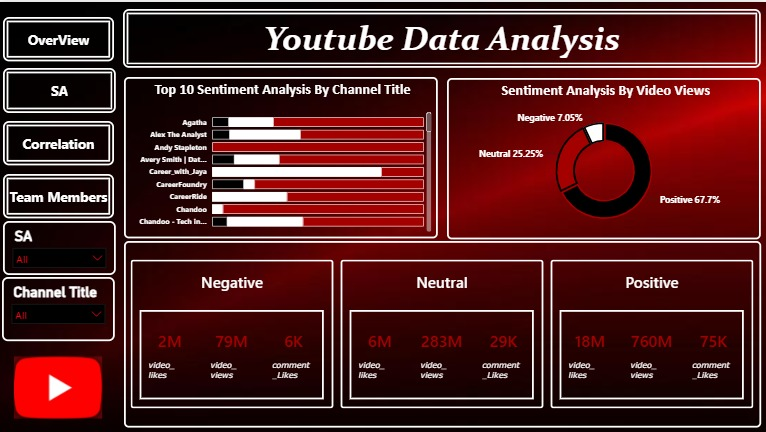
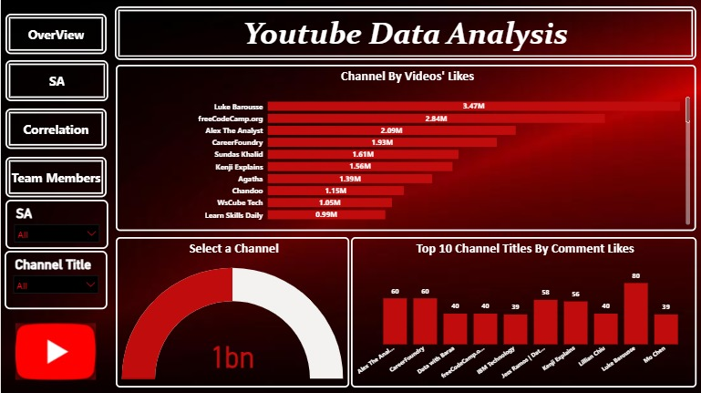
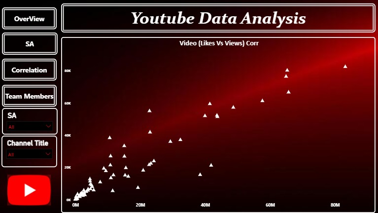
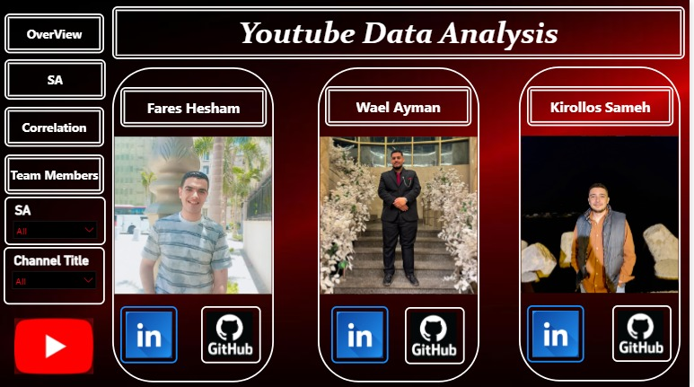

# 🎥 YouTube Sentiment Analysis

An end-to-end YouTube Sentiment Analysis project that combines **Machine Learning**, **Power BI**, and **Streamlit** to analyze YouTube video performance and audience sentiment.

---

# 📌 Project Overview

This project analyzes YouTube data using Machine Learning techniques and presents the results through an interactive Power BI dashboard and a Streamlit web application.

## Project Workflow

- Data Collection
- Data Cleaning & Preprocessing
- Exploratory Data Analysis (EDA)
- Sentiment Analysis
- Feature Engineering
- Machine Learning Model (SVM)
- Model Evaluation
- Interactive Dashboard
- Streamlit Deployment

---

# 🛠️ Technologies Used

- Python
- Pandas
- NumPy
- Scikit-learn
- Streamlit
- Power BI
- Joblib

---

# 📊 Dashboard Preview

## Overview



---

## Sentiment Analysis



---

## Correlation Analysis



---

## Team Members



---

# 🚀 Features

- Interactive Power BI Dashboard
- Sentiment Analysis
- Correlation Analysis
- Machine Learning Prediction (SVM)
- Dynamic Filters
- KPI Cards
- Streamlit Web Application

---

# 📂 Repository Structure

```text
YouTube-Sentiment-Analysis/
│
├── screenshots/
│   ├── dashboard1.jpeg
│   ├── dashboard2.jpeg
│   ├── dashboard3.jpeg
│   └── dashboard4.jpeg
│
├── app.py
├── YouTube_Sentiment_Analysis.ipynb
├── Youtube_Data_Final.csv
├── svm_model.pkl
├── tfidf_vectorizer.pkl
├── label_encoder.pkl
├── requirements.txt
└── README.md
```

---

# ▶️ Run Locally

Clone the repository

```bash
git clone https://github.com/your-username/YouTube-Sentiment-Analysis.git
```

Install dependencies

```bash
pip install -r requirements.txt
```

Run the Streamlit application

```bash
streamlit run app.py
```

---

# 👥 Team Members

- Wael Ayman
- Fares Hesham
- Kirollos Sameh

---

# ⭐ Support

If you found this project useful, don't forget to ⭐ the repository.
